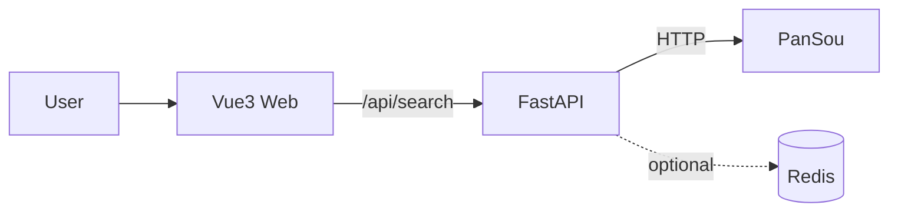

# OpenMeta - 网盘聚合搜索引擎

## 简介
OpenMeta 是一个**网盘聚合搜索引擎**，采用混合引擎架构（**FastAPI + PanSou + Vue3**）：

- **前端**：Vue3（Vite）提供简洁的搜索 UI
- **后端**：FastAPI 提供统一 API（`/api/search`）与健康检查（`/health`）
- **搜索源**：对接 PanSou（可通过环境变量配置）；未配置时可降级返回空结果，便于快速跑通

本仓库提供三种部署方式：
- 方案 A：本地开发（后端热更新 + 前端 dev server）
- 方案 B：Docker 部署（Nginx 托管前端 + 反代后端，一键上线）
- 方案 C：Vercel 部署（GitHub 自动构建 + 全球边缘网络 + 免费额度可用）

---

## 快速开始
以下示例以 **Docker 一键部署**为最快路径（适合“先上线再优化”）：

```bash
git clone <your-repo-url> openmeta && cd openmeta
cp .env.example .env
./scripts/deploy-docker.sh
```

部署完成后：
- Web：`http://<服务器IP>/`
- Health：`http://<服务器IP>/health`
- API：`http://<服务器IP>/api/search?q=三体`

建议立即做一次健康检查：

```bash
./scripts/health-check.sh --mode docker
```

> 如需获得真实搜索结果，请编辑 `.env` 并配置 `PANSOU_HOST / PANSOU_USER / PANSOU_PWD`。

---

## 三种部署方案

### 方案 A：本地开发

#### 环境要求
- Python **3.9+**
- Node.js **18+**（前端开发/构建需要）

#### 一键初始化并启动后端

```bash
./scripts/setup-local.sh
```

脚本会自动完成：检查 Python 版本 → 创建虚拟环境 → 安装依赖 → 生成 `.env` → 启动后端（热更新）。

默认访问：
- 后端：`http://127.0.0.1:8000`
- 健康检查：`http://127.0.0.1:8000/health`
- 搜索接口：`http://127.0.0.1:8000/api/search?q=三体`

#### 启动前端（Vue3）

```bash
cd frontend
npm install
npm run dev
```

前端地址：`http://127.0.0.1:5173`

#### 本地健康检查（包含一次测试搜索）

```bash
./scripts/health-check.sh --mode local
```

---

### 方案 B：Docker 部署

#### 前置条件
- Docker
- Docker Compose（`docker compose` 或 `docker-compose`）

#### 一键启动

```bash
cp .env.example .env
./scripts/deploy-docker.sh
```

> 默认会使用 `docker-compose-prod.yml`：
> - Nginx：托管前端静态文件 + 反代后端 `/api/*` 与 `/health`
> - 后端：FastAPI
> - Redis：默认不启用（可选 profile）

#### 内存占用说明
- 默认配置下（后端 + Nginx），通常**< 500MB**（与机器、并发、日志量有关）。
- `docker-compose-prod.yml` 中包含 `deploy.resources` 的参考限制（注意：非 Swarm 模式下该字段可能被 Docker Compose 忽略，仅作为建议）。

#### （可选）启用 Redis

```bash
./scripts/deploy-docker.sh --with-redis
```

并在 `.env` 中设置：

```env
REDIS_HOST=redis
```

#### 更新/升级步骤

```bash
git pull
./scripts/deploy-docker.sh
```

常用运维命令：

```bash
# 查看日志
docker compose -f docker-compose-prod.yml logs -f --tail=200

# 查看运行状态
docker compose -f docker-compose-prod.yml ps

# 停止
docker compose -f docker-compose-prod.yml down
```

---

### 方案 C：Vercel 部署

#### 你需要
- GitHub 账号（推荐走 Git 集成自动部署）

#### 自动部署配置
1. 将代码推送到 GitHub
2. 打开 https://vercel.com/new 导入仓库
3. 保持 Root Directory 为**仓库根目录**（本仓库提供根目录 `vercel.json`）
4. 在 Project → Settings → Environment Variables 配置环境变量（见下文）
5. 点击 Deploy

也可以用脚本快速检查配置并打印步骤：

```bash
./scripts/deploy-vercel.sh
```

#### 域名绑定
Vercel Dashboard：Project → Settings → Domains，按提示添加域名并配置 DNS。

#### 成本说明（免费）
- **Vercel Free**：适合个人/小流量站点（可能存在冷启动与配额限制）
- **Vercel Pro**：适合更高并发、团队协作、更高配额与 SLA

---

## 环境变量
环境变量模板见仓库根目录：`.env.example`。

### 完整列表与说明

| 变量名 | 必填 | 说明 | 示例 |
|---|---:|---|---|
| `PANSOU_HOST` | 否 | PanSou 服务地址；不填则降级返回空结果（用于快速跑通） | `http://112.124.53.114:8888` |
| `PANSOU_USER` | 否 | PanSou 账号 | `admin` |
| `PANSOU_PWD` | 否 | PanSou 密码 | `******` |
| `REDIS_HOST` | 否 | Redis 主机（启用 Redis 时建议为 `redis`） | `redis` |
| `REDIS_PORT` | 否 | Redis 端口 | `6379` |
| `REDIS_PASSWORD` | 否 | Redis 密码 |  |
| `BACKEND_HOST` | 否 | 本地后端监听地址（脚本用） | `0.0.0.0` |
| `BACKEND_PORT` | 否 | 本地后端端口（脚本用） | `8000` |
| `LOG_LEVEL` | 否 | 日志级别 | `INFO` |
| `RATE_LIMIT_PER_MINUTE` | 否 | 每 IP 每分钟请求数（可选） | `10` |
| `SEARCH_TIMEOUT` | 否 | 请求 PanSou 的超时（秒） | `15` |
| `CORS_ALLOW_ORIGINS` | 否 | CORS 允许来源（逗号分隔） | `http://localhost:5173` |
| `APP_MODULE` | 否 | 覆盖后端入口（一般不需要） | `backend.app.main:app` |

### 三种部署方式的配置方法

- **本地开发**：
  - `cp .env.example .env` 后编辑 `.env`
  - `./scripts/setup-local.sh` 会在没有 `.env` 时自动复制生成

- **Docker**：
  - 推荐：服务器上创建/编辑 `.env`
  - `docker-compose-prod.yml` 通过 `env_file: .env` 注入

- **Vercel**：
  - Vercel Dashboard → Project → Settings → Environment Variables
  - 生产建议只在 Production 环境配置密钥

---

## 故障排查

### 常见问题
1. **前端能打开，但搜索为空/报错**
   - 未配置 `PANSOU_HOST`：后端会降级返回空结果（这是预期行为）
   - 已配置但不可达：检查 PanSou 是否可访问、账号密码是否正确

2. **Docker 部署后 /health 不通 或 502**
   - 端口冲突：确认宿主机 80 端口未被占用
   - 查看日志：`docker compose -f docker-compose-prod.yml logs -f --tail=200`

3. **Vercel 部署后 API 超时**
   - 外部依赖（PanSou）对 Vercel 出网不可达
   - 适当降低 `SEARCH_TIMEOUT`

4. **CORS 跨域问题（本地开发常见）**
   - `.env` 设置：`CORS_ALLOW_ORIGINS=http://localhost:5173`

### 日志查看方法
- 本地：直接看 `uvicorn` 输出
- Docker：`docker compose -f docker-compose-prod.yml logs -f --tail=200`
- Vercel：Dashboard → Deployments → Functions → Logs

### 性能诊断
用 `curl` 观察接口耗时：

```bash
curl -s -o /dev/null -w 'time_total=%{time_total}\n' 'http://127.0.0.1:8000/api/search?q=三体'
```

---

## 架构说明

### 系统架构图



### 组件说明
- **Vue3**：负责展示与交互，调用 `/api/search` 获取搜索结果
- **FastAPI**：统一封装外部搜索源接口，输出结构化 JSON
- **PanSou**：外部搜索源（可替换/扩展）
- **Redis（可选）**：用于缓存、限流等

### 数据流程
1. 用户在前端输入关键词
2. 前端请求：`GET /api/search?q=<keyword>`
3. 后端请求 PanSou，并返回结果（失败时返回空结果 + error 信息）
4. 前端渲染结果列表

---

## 开发指南

### 本地修改代码步骤
1. 启动后端：`./scripts/setup-local.sh`
2. 启动前端：`cd frontend && npm install && npm run dev`
3. 修改代码后：
   - 后端会自动热更新
   - 前端会自动热更新

### 提交 PR 流程
1. Fork 仓库并创建 feature 分支
2. 保持改动小而清晰（一次 PR 聚焦一个问题）
3. 在 PR 描述中写清：改动点 / 测试方式 / 影响范围

---

## 部署对比表

| 方案 | 成本 | 性能 | 维护 | 适用场景 |
|------|------|------|------|---------|
| 本地 | 免费 | 快 | 低 | 开发调试 |
| Docker | 低 | 快 | 中 | 团队服务器 |
| Vercel | 免费 | 快 | 低 | 小流量站点 |

---

## 快速参考卡

### 一键启动命令
- 本地后端：`./scripts/setup-local.sh`
- Docker 上线：`cp .env.example .env && ./scripts/deploy-docker.sh`
- Vercel 指南：`./scripts/deploy-vercel.sh`

### 常用故障排查命令

```bash
# 本地健康检查
./scripts/health-check.sh --mode local

# Docker 健康检查
./scripts/health-check.sh --mode docker

# Docker 日志
docker compose -f docker-compose-prod.yml logs -f --tail=200
```

### 环境变量速查表（最常用）
- `PANSOU_HOST / PANSOU_USER / PANSOU_PWD`
- `CORS_ALLOW_ORIGINS`
- `LOG_LEVEL`

