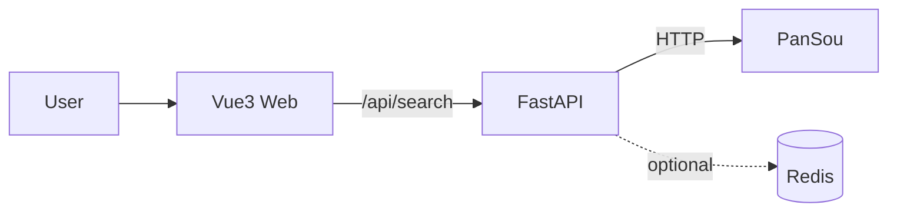

# OpenMeta

OpenMeta 是一个**网盘聚合搜索引擎**：对接 PanSou 等搜索源，通过统一 API 聚合多来源结果，并提供一个轻量的 Web 搜索界面。

- **混合引擎**：可同时接入多个搜索源（PanSou / 自建源 / 第三方源），按权重聚合。
- **多源聚合**：统一搜索 API，返回结构化数据，便于二次开发。
- **极速部署**：本地开发、Docker 一键部署、Vercel 自动构建部署三种方式均可快速上线。

## 系统架构（FastAPI + PanSou + Vue3）



- **前端**：Vue3（Vite）提供搜索 UI
- **后端**：FastAPI 提供 `/health` 与 `/api/search`
- **搜索源**：PanSou（通过环境变量配置地址与账号）
- **可选缓存/限流**：Redis

---

## 快速开始（本地开发：三行命令）

> 默认后端 `http://127.0.0.1:8000`，前端 `http://127.0.0.1:5173`

```bash
git clone <your-repo-url> openmeta && cd openmeta
./scripts/setup-local.sh
cd frontend && npm install && npm run dev
```

打开浏览器访问：
- 前端：`http://127.0.0.1:5173`
- 后端健康检查：`http://127.0.0.1:8000/health`

### 搜索演示

- UI 搜索：在页面输入关键词，如 `三体` / `PDF` / `电影`
- 命令行：

```bash
curl 'http://127.0.0.1:8000/api/search?q=%E4%B8%89%E4%BD%93'
```

---

## 部署指南

### 方案 A：本地开发

#### 环境要求

- Python **3.9+**
- Node.js **18+**（仅前端需要）

#### 1) 创建虚拟环境

推荐直接使用一键脚本（会自动创建 `.venv`）：

```bash
./scripts/setup-local.sh --no-start
```

或手动创建：

```bash
python3 -m venv .venv
source .venv/bin/activate
```

#### 2) 安装依赖

```bash
pip install -r backend/requirements.txt
```

#### 3) 环境变量

```bash
cp .env.example .env
# 编辑 .env，填入 PanSou 账号密码等
```

#### 4) 启动命令

后端（开发热更新）：

```bash
./scripts/setup-local.sh
```

前端：

```bash
cd frontend
npm install
npm run dev
```

#### 5) 访问地址和测试

- 前端：`http://127.0.0.1:5173`
- 后端：`http://127.0.0.1:8000`
- 健康检查：

```bash
curl http://127.0.0.1:8000/health
```

- 一键健康检查（含一次测试搜索）：

```bash
./scripts/health-check.sh --backend http://127.0.0.1:8000 --frontend http://127.0.0.1:5173
```

---

### 方案 B：Docker 部署

#### 前置条件

- Docker
- Docker Compose（`docker compose` 或 `docker-compose`）

#### 1) 上传代码到服务器

```bash
git clone <your-repo-url> openmeta
cd openmeta
```

#### 2) 配置环境变量

```bash
cp .env.example .env
vim .env
```

#### 3)（可选）配置 Nginx

本项目会在容器内置 Nginx（反向代理后端并托管前端静态文件）。如你还需要**主机层 Nginx**（例如统一管理多个站点、开启 HTTPS），可以参考：

- 主机 Nginx → 反代到 `http://127.0.0.1:80`
- 开启 HTTPS（Let’s Encrypt）并强制跳转 HTTP→HTTPS

#### 4) 一条命令启动

```bash
./scripts/deploy-docker.sh
```

#### 5) 内存占用说明（<500MB）

在默认配置下（后端 + Nginx，不启用 Redis profile），实际占用与机器环境有关，通常在 **<500MB**。

- 需要更严格资源约束时：可在 `docker-compose-prod.yml` 的 `deploy.resources`（或宿主机层面）做限制。

#### 6) 访问地址

- Web：`http://<服务器IP>/`
- API：`http://<服务器IP>/api/search?q=三体`
- Health：`http://<服务器IP>/health`

---

### 方案 C：Vercel 部署

> 适合快速上线与全球加速。代码推送后自动构建、自动发布。

#### 1) GitHub 账号关联

- 将项目推送到 GitHub
- 在 Vercel 导入仓库：`https://vercel.com/new`

#### 2) 环境变量配置

在 Vercel Dashboard：Project → Settings → Environment Variables 中配置（至少配置必填项）：

- `PANSOU_HOST`
- `PANSOU_USER`
- `PANSOU_PWD`

可用脚本做基础校验并打印部署步骤：

```bash
./scripts/deploy-vercel.sh
```

#### 3) 自动构建和部署

- 本仓库提供 `vercel.json`，Vercel 会：
  - 构建前端（静态站点）
  - 部署后端（Python Serverless Function）

#### 4) 域名绑定

Project → Settings → Domains，按提示配置 DNS。

#### 5) 成本说明（免费/付费）

- **Free**：适合个人与小流量场景
- **Pro**：适合更高并发、团队协作、配额与 SLA 要求更高的场景

---

## 环境变量配置

### 变量列表（必填/可选）

| 变量名 | 必填 | 说明 | 示例 |
|---|---:|---|---|
| `PANSOU_HOST` | 是 | PanSou 服务地址 | `http://112.124.53.114:8888` |
| `PANSOU_USER` | 是 | PanSou 账号 | `admin` |
| `PANSOU_PWD` | 是 | PanSou 密码 | `******` |
| `REDIS_HOST` | 否 | Redis 主机（用于缓存/限流） | `localhost` |
| `REDIS_PORT` | 否 | Redis 端口 | `6379` |
| `REDIS_PASSWORD` | 否 | Redis 密码 | `` |
| `LOG_LEVEL` | 否 | 日志级别 | `INFO` |
| `RATE_LIMIT_PER_MINUTE` | 否 | 每 IP 每分钟限流 | `10` |
| `SEARCH_TIMEOUT` | 否 | 搜索源请求超时（秒） | `15` |
| `BACKEND_HOST` | 否 | 本地启动监听地址 | `0.0.0.0` |
| `BACKEND_PORT` | 否 | 本地启动端口 | `8000` |
| `CORS_ALLOW_ORIGINS` | 否 | CORS 允许来源（逗号分隔） | `http://localhost:5173` |

### 本地 .env 文件模板

见仓库根目录：`.env.example`

### Docker 中配置方式

- 推荐：在服务器上创建 `.env`，然后 `docker-compose-prod.yml` 通过 `env_file: .env` 注入
- 不推荐：直接写死在 `docker-compose-prod.yml`（避免秘钥进入仓库）

### Vercel 中配置方式

Vercel Dashboard → Project → Settings → Environment Variables

- 生产建议：只在 Production 环境变量里配置密钥
- 如果需要 Preview 环境联调：可在 Preview 也配置

---

## 故障排查

### 常见问题

1) **前端能打开，但搜索 500/空结果**
- 检查 `.env` 的 `PANSOU_*` 是否正确
- PanSou 可能不可达：后端会降级返回空结果，并带 `warning/error`

2) **Docker 部署后 502 / health 不通**
- 查看日志：
  - `docker compose -f docker-compose-prod.yml logs -f --tail=200`
- 检查端口占用：80 是否被其他服务占用

3) **Vercel 部署后 API 超时**
- 降低 `SEARCH_TIMEOUT`
- 检查 PanSou 是否对 Vercel 出网可达

4) **跨域（CORS）问题**
- 开发：`CORS_ALLOW_ORIGINS=http://localhost:5173`
- 生产：填你的域名，例如 `https://openmeta.example.com`

### 日志查看方法

- 本地：直接看终端（uvicorn 输出）
- Docker：`docker compose -f docker-compose-prod.yml logs -f --tail=200`
- Vercel：Project → Deployments → Functions / Logs

### 性能诊断

- 用 `curl -w` 观察接口耗时：

```bash
curl -s -o /dev/null -w 'time_total=%{time_total}\n' 'http://127.0.0.1:8000/api/search?q=三体'
```

- 优化建议：
  - 调整 `SEARCH_TIMEOUT`
  - 为热门关键词加缓存（Redis）
  - 在 Nginx 开启静态缓存（已为静态资源设置缓存头）

---

## 部署对比表（本地 / Docker / Vercel）

| 方案 | 优点 | 缺点 | 成本 | 性能/延迟 | 维护成本 |
|---|---|---|---|---|---|
| 本地开发 | 最适合开发调试、改代码最快 | 不适合对外提供稳定服务 | 低 | 取决于本机 | 低（仅本机） |
| Docker 部署 | 可控性高、环境一致、方便在服务器长期运行 | 需要服务器与基础运维 | 服务器成本 | 通常稳定，延迟低 | 中 |
| Vercel 部署 | 自动构建、全球边缘网络、上线最快 | Serverless 冷启动、配额限制、对外部依赖敏感 | Free/Pro | 全球访问快，但 API 可能受冷启动影响 | 低 |

**选择建议：**
- 开发与联调：本地开发
- 长期稳定对外服务：Docker + HTTPS（可配主机 Nginx 或云负载均衡）
- 快速发布/个人项目：Vercel

---

## 监控和维护指南

### 日志

- 本地：终端输出
- Docker：`docker compose logs`
- Vercel：Dashboard Logs

### 性能监控

- 最小可行：Nginx access log + 后端日志 + uptime 监控（例如 Uptime Kuma）
- 进阶：Prometheus + Grafana（自建）/ 第三方 APM

### 故障恢复

- Docker：`docker compose restart` / `docker compose down && docker compose up -d`
- Vercel：回滚到上一版本部署（Deployments）

### 更新升级步骤

- 本地：`git pull` → 重新安装依赖（如有）→ 重启
- Docker：`git pull` → `./scripts/deploy-docker.sh`（会触发重新构建）
- Vercel：推送代码到 GitHub，自动触发新部署

### 数据备份（如果有）

OpenMeta 默认不依赖持久化数据库。若启用了 Redis（缓存/限流），可使用 compose 的备份 profile：

```bash
docker compose -f docker-compose-prod.yml --profile redis --profile backup up -d
# 或按需执行一次：
docker compose -f docker-compose-prod.yml --profile backup run --rm redis-backup
```

---

## 安全最佳实践

- **密钥管理**：
  - 不要提交 `.env`
  - Vercel 使用 Dashboard 环境变量
  - 服务器使用权限最小化的 `.env` 文件
- **HTTPS/SSL**：
  - 生产强烈建议启用 HTTPS（主机 Nginx / Cloudflare / 负载均衡）
- **访问控制**：
  - 如需要：对管理类接口加鉴权（Basic/OAuth/Token）
  - 对外 API 进行限流（`RATE_LIMIT_PER_MINUTE`）
- **IP 白名单（如需要）**：
  - 可在主机层 Nginx/防火墙限制访问
- **定期更新**：
  - 依赖升级、系统补丁、Docker 镜像更新

---

## 贡献指南

1. Fork 本仓库
2. 新建分支：`feat/xxx` 或 `fix/xxx`
3. 本地运行：
   - 后端：`./scripts/setup-local.sh --no-start` 然后自行启动/调试
   - 前端：`cd frontend && npm i && npm run dev`
4. 提交 PR：
   - 描述修改内容、截图/测试结果
   - 说明是否影响部署（Docker/Vercel）

---

## 测试清单

- 本地开发
  - [ ] `/health` 返回 200
  - [ ] `/api/search` 可返回结果（或降级空结果）
  - [ ] 前端能发起搜索并展示
- Docker 部署
  - [ ] `./scripts/deploy-docker.sh` 一次启动成功
  - [ ] 内存占用符合预期（通常 <500MB）
  - [ ] 响应速度与日志正常
- Vercel 部署
  - [ ] 构建通过
  - [ ] 冷启动可接受（首次请求可能较慢）
  - [ ] 全球访问速度正常

---

## 快速参考卡

### 启动命令总结

- 本地后端：`./scripts/setup-local.sh`
- 本地前端：`cd frontend && npm run dev`
- Docker：`./scripts/deploy-docker.sh`
- Vercel：`./scripts/deploy-vercel.sh`（可加 `--deploy`）

### 常用命令速查

```bash
# 健康检查
./scripts/health-check.sh --backend http://127.0.0.1:8000 --frontend http://127.0.0.1:5173

# Docker 日志
docker compose -f docker-compose-prod.yml logs -f --tail=200

# Docker 停止
docker compose -f docker-compose-prod.yml down
```

### 环境变量速查

- 必填：`PANSOU_HOST` / `PANSOU_USER` / `PANSOU_PWD`
- 常用可选：`LOG_LEVEL` / `SEARCH_TIMEOUT` / `RATE_LIMIT_PER_MINUTE` / `CORS_ALLOW_ORIGINS`
